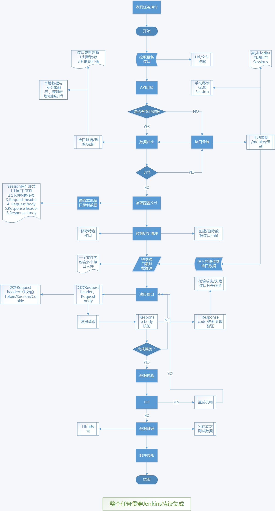

# ApiTests
**ApiTests**是一个快速验证接口正确性的框架，主要用于回归验证，亦可用于接口测试（需要拓展，目前还未支持，考虑后面加上）。


#### 功能

具体查看框架思路

- 配置文件配置基本信息
- 接口只需录制一次，后续只需维护变动的接口
- 目前仅支持http的post请求方式，get以及https后续考虑加上，亦可自己完善
- 快速的接口反馈，通常1分钟内完成，取决于机器/网络/服务器因素
- 日常监控，后续加上
- 可以屏蔽特殊接口
- 创建的数据清理
- 重试机制
- 接口去重


#### 接口流程走向

```
接口回归测试启动...
清理测试数据...
读取配置文件中...
读取接口数据中...
接口请求中，请等待...
http://your host/api/
....................................................
http://your host/api/
http://your host/api/
RequestException url: http://your host/api/
HTTPConnectionPool(host='http://your host', port=80): Read timed out. (read timeout=30)
IndexError url:
http://your host/api/
接口请求完成！
发现diff接口，重试机制启动...
第1次尝试请求diff...
diff sessions: A.txt
diff sessions: B.txt
http://your host/api/A
http://your host/api/B
RequestException url: http://your host/api/B
HTTPConnectionPool(host='http://your host', port=80): Read timed out. (read timeout=30)
IndexError url:
http://your host/api/B
发现diff存在，继续尝试请求...
diff请求完成...
正在整理创建的数据...
清理创建的接口数据...
http://your host/api/
http://your host/api/
http://your host/api/
http://your host/api/
http://your host/api/
http://your host/api/
http://your host/api/
接口数据清理完成！
测试报告准备中...
接口回归测试完成！
耗时： 65s
```

#### 请求接口后写入本地的数据说明

```
ErrorResponse >> 响应状态码非200的接口写入该文件
FieldChange >> 字段改变的接口写入该文件
ProgramCrash >> 程序异常接口写入该文件
Unexpected >> 未达到预期字段校验的接口写入该文件
VerifyRequest >> 需要再次确认的接口写入该文件
GetUserInfoV2 >> 正常接口（一个接口一个文件）
```


#### 关于接口回放的数据

- 第一次的数据来自fiddler录制
- 第二次及以后的数据来自第一次请求写入本地的正常接口文件 + fiddler继续录制需要检查的接口
- 一般来说不要一直拿第一次fiddler录制的数据使用，目的在于测试接口对各个客户端版本的兼容情况
- 接口回放可以跑线上运行的客户端全部版本接口（一个版本一套接口）

#### 框架的下一步

- 优雅的Html报告
- 邮件通知
- 持续集成
- 测试数据另存，方便后续查阅

#### 框架的更下一步

- 接口压测
- 接口自动化（api测试）pass：目前只是回归验证
- 简单的GUI界面


#### 框架思路




#### 使用方式

- 环境配置
  - Python 3.x
  - fiddler一枚（配置抓取手机请求）
  - PyCharm 


- 替换fiddler js

  - 项目根目录的fiddler js整个文件内容替换fiddler的js
    - 打开fiddler的Customize Rules功能
    - 删除所有内容，并把fiddler js内容全部拷贝进去
    - 修改拦截的host等信息
    - [fiddler保存请求](https://testerhome.com/topics/5481)

  fiddler js自定义信息

  ```javascript

  	//自定义参数设置
  	public static var filterUrl = "your host";
  	public static var filePath = "D:\\Fiddler Sessions\\Api\\";
  	public static var filePathForRequested = "D:\\Fiddler Sessions\\Requested.txt";
  	public static var filePathForErrorResponse = "D:\\Fiddler Sessions\\ErrorResponse.txt";
  	public static var filePathForVerifyRequset = "D:\\Fiddler Sessions\\VerifyRequset.txt";
  	public static var filePathForRemoveSession = "D:\\Fiddler Sessions\\RemoveSession.txt";
  	public static var filePathForAddSession = "D:\\Fiddler Sessions\\AddSession.txt";
  ```

  ​

- token/session替换

  - 替换成你们项目对应的token等
  - 修改配置文件
  - 修改response body json 判断逻辑


- 运行方式
  - 总入口在项目的launcher文件夹下面的RequestApi.py